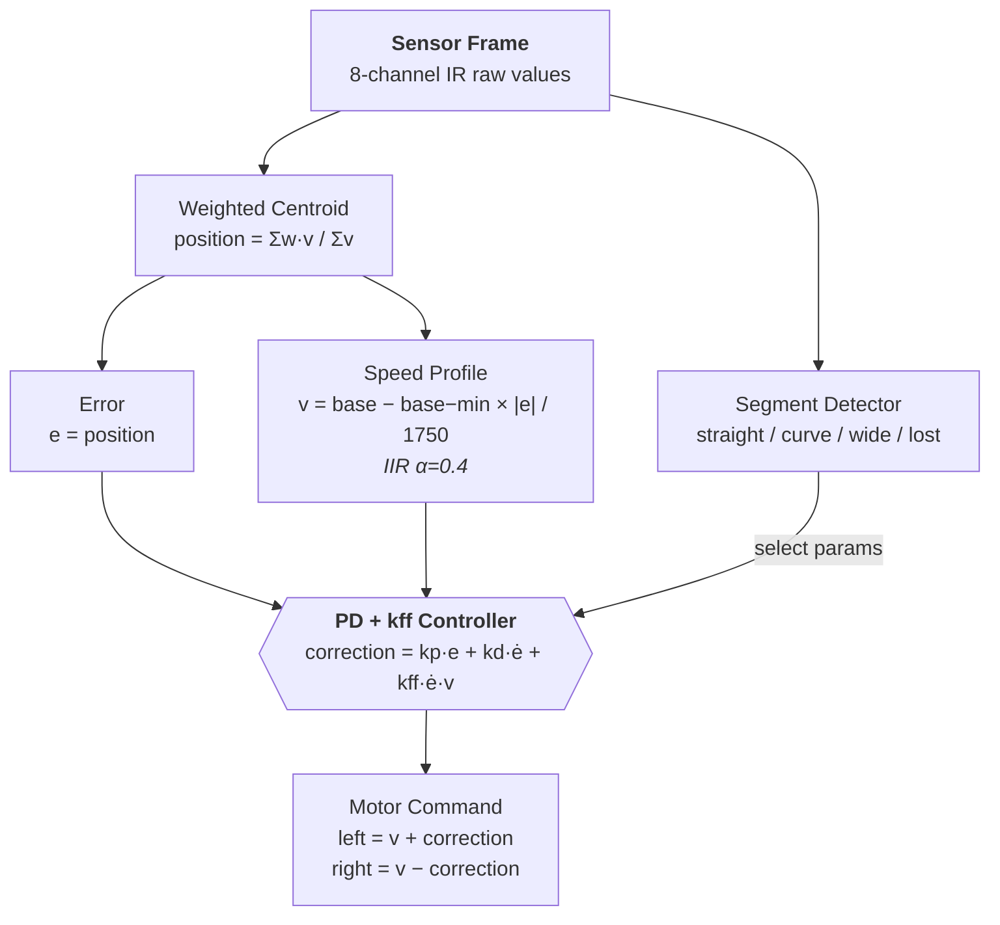
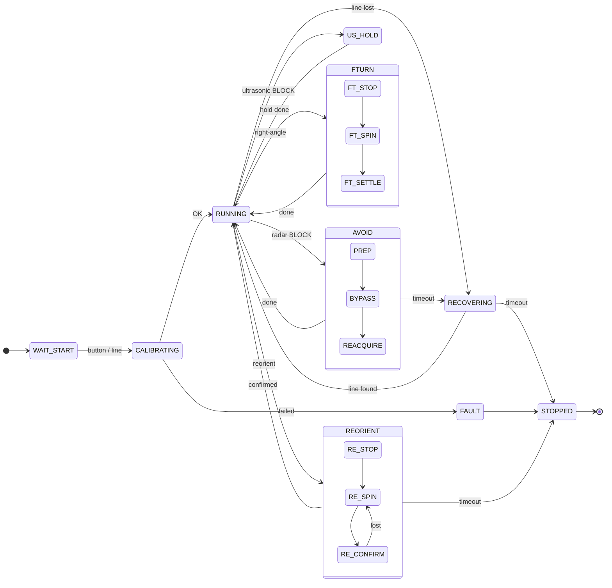

# TDPS — Autonomous Line-Following Robot

> STM32F407VET6-based line-following robot with PD+feedforward control, radar obstacle avoidance, ultrasonic overhead detection, and LoRa telemetry.

[]()
[](LICENSE)
[]()

An embedded systems project implementing a competition-ready autonomous car that navigates a predefined course using 8-channel IR sensors, avoids forward obstacles via millimeter-wave radar, detects overhead obstacles via ultrasonic sensor, and reports checkpoints over LoRa radio.

## Key Features

| Feature | Implementation |
|---------|---------------|
| **PD + Curvature Feedforward** | 6-parameter controller: `correction = kp·e + kd·ė + kff·ė·v`, replaces a 62-parameter legacy architecture |
| **Segment-Adaptive Control** | Auto-classifies track segments (straight / gentle curve / tight curve / wide line / lost) with per-segment PD parameters and IIR-smoothed transitions |
| **Radar Obstacle Avoidance** | HLK-LD2410S provides CLEAR/WARN/BLOCK states; executes timed open-loop bypass: PREP → BYPASS (3-phase arc) → REACQUIRE |
| **Ultrasonic Overhead Detection** | HC-SR04 detects overhead obstacles; stops, sends LoRa checkpoint, holds 3s, then resumes |
| **Fixed-Route Navigation** | Scripted sequence of T-intersections, right-angle turns, and cross intersections with confirmation logic |
| **Async LoRa Telemetry** | EWM22A sends `TEAM=15,NAME=TDPS,CP=<id>,TIME=<MM:SS>` with queue, retry, and optional ACK |
| **PC Stub Test Suite** | Full regression compiles on any PC with gcc — no hardware, no RTOS |
| **Automated Parameter Sweeping** | 63-group simulator sweeps (36 coarse + 27 kff-fine), achieving 97.65/100 score |

## Architecture

```mermaid
graph LR
    subgraph APP["<b>Application</b>"]
        direction TB
        A1["<b>lf_app</b><br/>state machine"]
        A2["<b>lf_app_*</b><br/>util · sensor · route<br/>segment · avoid"]
        A3["<b>wl_app</b><br/>race timing"]
    end

    subgraph ALG["<b>Algorithm</b>"]
        direction TB
        B1["<b>lf_sensor</b><br/>8-ch IR"]
        B2["<b>lf_control</b><br/>PD + kff"]
        B3["<b>lf_radar</b><br/>LD2410S"]
        B4["<b>lf_ultrasonic</b><br/>HC-SR04"]
        B5["<b>lf_chassis</b><br/>diff drive"]
        B6["<b>wl_lora</b><br/>EWM22A"]
    end

    subgraph PLAT["<b>Platform</b>"]
        direction TB
        C1["<b>lf_platform</b>"]
        C2["<b>wl_platform</b>"]
        C3["<b>UART callbacks</b>"]
    end

    subgraph EXT["<b>Extensions</b>"]
        direction TB
        D1["<b>wireless_hooks</b>"]
        D2["<b>lf_debug_monitor</b>"]
        D3["<b>lf_led_blink</b>"]
    end

    APP -->|"data flow"| ALG
    ALG -->|"HAL calls"| PLAT
    EXT -.->|"tick hooks"| APP
```



### Control Algorithm



### State Machine



## Quick Start

### Prerequisites

| Tool | Purpose | Required |
|------|---------|----------|
| gcc | PC stub tests & simulator | Yes (for testing) |
| CMake 3.20+ | Build system | Optional (gcc manual build works too) |
| arm-none-eabi-gcc | MCU cross-compilation | For flashing to hardware |
| Keil MDK | Board-level SWD debug | Optional |

### Build & Test (PC)

```bash
# CMake build
cmake -S TDPS/firmware -B TDPS/firmware/build \
  -DTDPS_TARGET_MCU=OFF -DTDPS_BUILD_TESTS=ON
cmake --build TDPS/firmware/build
ctest --test-dir TDPS/firmware/build --output-on-failure

# Quick smoke test without CMake
mkdir -p TDPS/firmware/build/gcc
gcc -ITDPS/firmware/Inc -ITDPS/firmware/common -ITDPS/firmware/platform \
    TDPS/firmware/Src/{lf_app,lf_app_util,lf_app_sensor,lf_app_route,lf_app_segment,lf_app_avoid,lf_chassis,lf_config,lf_config_profiles,lf_control,lf_debug_monitor,lf_future_hooks,lf_led_blink,lf_radar,lf_sensor,lf_ultrasonic,lf_ultrasonic_stub,wireless_hooks,wl_app,wl_config,wl_lora,wl_protocol,lf_platform_stub,wl_platform_stub}.c \
    TDPS/firmware/test/test_lf_stub.c -o TDPS/firmware/build/gcc/lf_test -lm
./TDPS/firmware/build/gcc/lf_test
```

### Simulator Regression

```bash
# Quick gate (score ≥ 82, detection ≥ 94%, max lost ≤ 0.35s)
bash TDPS/simulator/scripts/line_follow_cli.sh quick

# Full system test (line-follow + radar + wireless)
bash TDPS/simulator/scripts/run_system_autotest.sh

# 20-seed stability run
bash TDPS/simulator/scripts/run_line_follow_stability.sh

# Parameter sweep
python TDPS/simulator/scripts/run_line_follow_param_sweep.py --mode coarse
```

### MCU Cross-Compile

```bash
cmake -S TDPS/firmware -B TDPS/firmware/build \
  -DTDPS_TARGET_MCU=ON \
  -DCMAKE_TOOLCHAIN_FILE=TDPS/firmware/cmake/arm-none-eabi-gcc.cmake
cmake --build TDPS/firmware/build
# Flash tdps_firmware.elf via ST-Link
```

## Hardware

| Component | Model | Interface | Purpose |
|-----------|-------|-----------|---------|
| MCU | STM32F407VET6 | — | Main controller (168 MHz Cortex-M4) |
| Chassis | Wheeltec L150 | — | Differential-drive, ~16 cm wheel track |
| Line sensor | Yahboom 8-LP | USART2 (115200) | 8-channel IR line detection |
| Radar | HLK-LD2410S | USART3 (115200) | Forward obstacle detection (CLEAR/WARN/BLOCK) |
| Ultrasonic | HC-SR04 | GPIO (PD3/PD4) | Overhead obstacle detection |
| LoRa | EWM22A-900BWL22S | UART5 (115200) | Checkpoint communication |
| Motor driver | DRV8874 | TIM8/TIM10 PWM | Dual H-bridge, differential drive |
| Encoders | — | TIM3/TIM4 | Quadrature wheel encoders |

Full pin mapping: [`docs/hardware.md`](docs/hardware.md)

## Project Structure

```
├── TDPS/
│   ├── firmware/                 STM32 firmware (C99, no RTOS)
│   │   ├── Src/                  Application source files (34 files)
│   │   │   ├── lf_app*.c        Line-following state machine (6 modules)
│   │   │   ├── lf_control.c     PD + curvature feedforward controller
│   │   │   ├── lf_sensor*.c     IR sensor acquisition + UART protocol
│   │   │   ├── lf_radar*.c      LD2410S radar driver + UART parser
│   │   │   ├── lf_ultrasonic*.c HC-SR04 ultrasonic driver
│   │   │   ├── lf_chassis.c     Differential drive motor commands
│   │   │   ├── wl_*.c           LoRa wireless + protocol
│   │   │   └── main.c           Entry point + main loop
│   │   ├── Inc/                  Public headers (28 files)
│   │   ├── common/               Shared utilities (clamp.h)
│   │   ├── platform/             MCU port configuration headers
│   │   ├── test/                 PC stub regression tests
│   │   ├── Core/                 STM32 HAL core (CubeMX)
│   │   ├── Drivers/              CMSIS + STM32F4xx HAL driver
│   │   ├── MDK-ARM/              Keil uVision project
│   │   └── cmake/                ARM cross-compile toolchain
│   ├── simulator/                Browser 2D simulator + CLI test harness
│   │   ├── scripts/              Build & test automation (9 scripts)
│   │   └── sim_tests/            Test scenarios + harness C code
│   └── tests/                    Board-level & standalone peripheral tests
│       ├── board/tdps_board_test/  Full hardware test suite
│       └── standalone/             Individual peripheral tests
├── docs/                         Design, tuning, and testing documentation
├── docs_reference/               Hardware vendor reference index
├── reports/                      Report generation pipelines
├── LICENSE                       Apache License 2.0
└── README.md                     This file
```

## Documentation

| Document | Description |
|----------|-------------|
| [`docs/basic_design.md`](docs/basic_design.md) | System architecture, layered design, milestone plan |
| [`docs/line_following.md`](docs/line_following.md) | Sensor pipeline, PD controller formula, state machine details |
| [`docs/tuning.md`](docs/tuning.md) | All tunable parameters, sweep results, symptom→parameter quick lookup |
| [`docs/wireless_comm.md`](docs/wireless_comm.md) | LoRa message format, async TX queue, ACK protocol |
| [`docs/hardware.md`](docs/hardware.md) | Component list, pin mapping, D-frame polarity convention |
| [`docs/testing/quickstart_3min.md`](docs/testing/quickstart_3min.md) | 3-minute CLI quickstart guide |
| [`docs/testing/baseline.md`](docs/testing/baseline.md) | Frozen baseline results (score 92.07, detection 99.70%) |
| [`docs/testing/report_schema.md`](docs/testing/report_schema.md) | JSON report schema for automated result parsing |

## Gate Criteria

| Metric | Quick Gate | Stability Gate (20 seeds) |
|--------|-----------|--------------------------|
| Overall score | ≥ 82 | ≥ 80 (min) |
| Line detection rate | ≥ 94% | ≥ 93% (min) |
| Max longest lost | ≤ 0.35s | ≤ 0.40s |
| Scenario min score | ≥ 70 | ≥ 70 |

## License

[Apache License 2.0](LICENSE)
